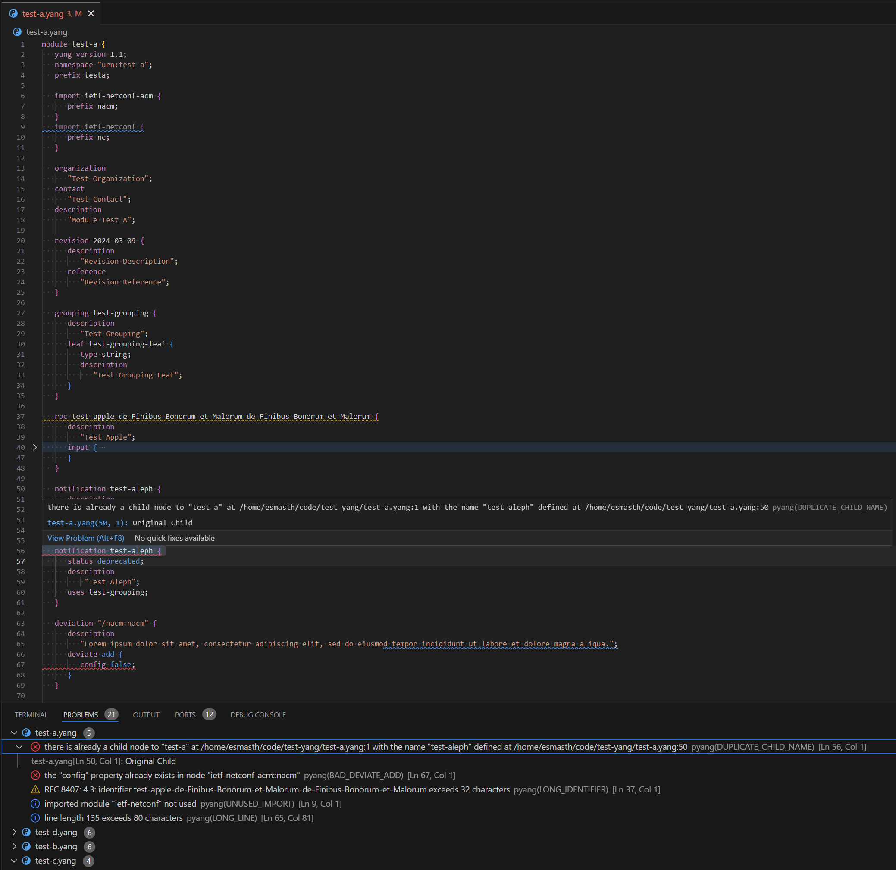
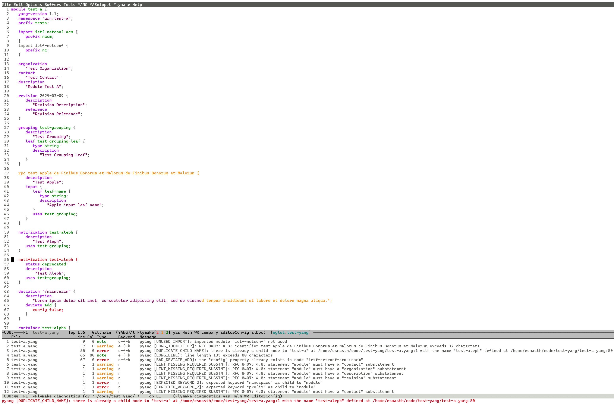

# pyang LSP Server

`pyang` can be executed as a [Microsoft LSP][lsp] Server for YANG Language.

See **LSP Server** section in `pyang` [manpage](./pyang.1.md) for details on
related command line interface option arguments.

[lsp]: https://microsoft.github.io/language-server-protocol/

## Server Capabilities

pyang LSP server advertises the following capabilities as part of the response
in [Initialize Request][initialize] procedure as seen below.

```json
{
    "id": 1,
    "jsonrpc": "2.0",
    "result": {
        "capabilities": {
            "positionEncoding": "utf-16",
            "textDocumentSync": {
                "openClose": true,
                "change": 1,
                "willSave": false,
                "willSaveWaitUntil": false,
                "save": false
            },
            "documentFormattingProvider": true,
            "executeCommandProvider": {
                "commands": []
            },
            "diagnosticProvider": {
                "interFileDependencies": true,
                "workspaceDiagnostics": true,
                "identifier": "pyang"
            },
            "workspace": {
                "workspaceFolders": {
                    "supported": true,
                    "changeNotifications": true
                },
                "fileOperations": {}
            }
        },
        "serverInfo": {
            "name": "pyang",
            "version": "v0.1"
        }
    }
}
```

See following sections for detailed support statements including non-compliance.

[initialize]: https://microsoft.github.io/language-server-protocol/specifications/lsp/3.17/specification/#initialize

## Configuration

pyang does not support workspace configuration over LSP, and for clients which
support `workspace.didChangeConfiguration` following informative log can be seen
when a client sends `workspace/didChangeConfiguration` notification.

```text
Ignoring notification for unknown method "workspace/didChangeConfiguration"
```

Any configurability is limited to the following channels, listed in ascending
order of precedence

1. Defaults within pyang implementation
2. `pyang` command line arguments
3. LSP client provided params in context of an rpc/notification

The pyang defaults, command line arguments, and LSP client rpc/notification
details per feature can be found in specific [Features](#features) sections.

## Features

### Diagnostics

LSP provides following procedures to diagnose language content.

* [Publish Diagnostics][textDocument_publishDiagnostics]
* [Pull Diagnostics][textDocument_pullDiagnostics]

pyang supports both the above procedures.

pyang skips statement keyword and grammar checks if there are YANG parser errors
which prevent further validation. Syntax errors which prevent parsing of the
whole file by pyang need to be fixed before further diagnostics are shared over
LSP to the client.

[textDocument_publishDiagnostics]: https://microsoft.github.io/language-server-protocol/specifications/lsp/3.17/specification/#textDocument_publishDiagnostics
[textDocument_pullDiagnostics]: https://microsoft.github.io/language-server-protocol/specifications/lsp/3.17/specification/#textDocument_pullDiagnostics

#### Configuration

pyang default diagnostics configuration parameters are as listed below, with
CLI based day0 and LSP based day1/day2 configuration setting/override mechanisms.

Parameter | Default | CLI (~~unnecessary~~) | LSP |
----------|---------|-----|-----|
**RFC 8407** Checks Enabled | False | **~~--lint~~** | N/A |
Strict YANG Compliance | False | **~~--strict~~** | N/A |
Canonical Order | False | **~~--canonical~~** | N/A |
Disable All Warnings | False | **-Wnone** | N/A |
Treat an Error as a Warning | N/A | **-W** _errorcode_ |  N/A |
Treat a Warning as an Error | N/A | **-E** _errorcode_ |  N/A |
Treat All Warnings as Errors | False | **-Werror** | N/A |
Maximum Line Length | 80 | **--max-line-length** | N/A |
Maximum Identifier Length | 64 | **--max-identifier-length** | N/A |

#### Diagnostic Context

pyang currently only stores the error context at the granularity of file and
line numbers. This resolution prevents high precision error context underlines
for symbols or arguments, that are dependent on a range of line and column tuple.

LSP [`Diagnostic`][diagnostic] [`Range`][range] is currently set to the whole
line.

[diagnostic]: https://microsoft.github.io/language-server-protocol/specifications/lsp/3.17/specification/#diagnostic
[range]: https://microsoft.github.io/language-server-protocol/specifications/lsp/3.17/specification/#range

#### Diagnostic Severity

pyang validation error levels are translated to LSP diagnostic severities as
mapped in the table below

pyang `level` (`type`) | LSP [`diagnosticSeverity`][diagnosticSeverity] |
-----------------------|------------------------------------------------|
**1** (Critical Error) | Error                                          |
**2** (Major Error)    | Error                                          |
**3** (Minor Error)    | Warning                                        |
**4** (Warning)        | Information                                    |

[diagnosticSeverity]: https://microsoft.github.io/language-server-protocol/specifications/lsp/3.17/specification/#diagnosticSeverity

#### Other Diagnostic Metadata

[`DiagnosticTag`][diagnosticTag] `Unnecessary` is reported for `UNUSED_*` error
codes.

[`DiagnosticRelatedInformation`][diagnosticRelatedInformation] is reported for
`DUPLICATE_*` error codes.

[diagnosticTag]: https://microsoft.github.io/language-server-protocol/specifications/lsp/3.17/specification/#diagnosticTag
[diagnosticRelatedInformation]: https://microsoft.github.io/language-server-protocol/specifications/lsp/3.17/specification/#diagnosticRelatedInformation

#### Demo


_Diagnostics view using [Visual Studio Code][vscode] via a language extension_

[vscode]: https://www.gnu.org/software/emacs/manual/html_mono/eglot.html


_Diagnostics view using GNU Emacs via its [Eglot][eglot] LSP client submodule_

[eglot]: https://www.gnu.org/software/emacs/manual/html_mono/eglot.html

### Formatting

LSP provides following procedures to format language content.

* [Document Formatting Request][textDocument_formatting] as advertised via the
  `documentFormattingProvider` capability
* [Document Range Formatting Request][textDocument_rangeFormatting] as
  advertised via the `documentRangeFormattingProvider` capability
* [Document on Type Formatting Request][textDocument_onTypeFormatting] as
  advertised via the `documentOnTypeFormattingProvider` capability

Out of the above, pyang only supports `documentFormattingProvider`, since the
mechanism used to format is based on YANG to YANG "translation". This also has
an implication that formatting request is only handled for a consistent YANG
file, i.e., no sytactical errors exist, e.g., `EOF_ERROR` or `SYNTAX_ERROR`.

#### Configuration

pyang default formatting configuration parameters are as listed below, with
CLI based day0 and LSP based day1/day2 configuration setting/override mechanisms.

Parameter | Default | CLI | LSP (For ~~unsupported~~, see below) |
----------|---------|-----|-----|
Indentation Size | 2 | **--yang-indent-size** | [`tabSize`][formattingOptions] |
Indentation Style | Spaces | N/A | [~~`insertSpaces`~~][formattingOptions] |
Trim Trailing Whitespace | True | N/A | [~~`trimTrailingWhitespace`~~][formattingOptions] |
Insert Final Newline | True | N/A | [`insertFinalNewline`][formattingOptions] |
Trim Final Newlines | True | N/A | [~~`trimFinalNewlines`~~][formattingOptions] |
Maximum Line Length | 80 | **--yang-line-length** | N/A |
Canonical Order | False | **--yang-canonical** | N/A |
Remove Unused Imports | False | **--yang-remove-unused-imports** | N/A |
Remove Comments | False | **--yang-remove-comments** |  N/A |

Following [`FormattingOptions`][formattingOptions] are currently not respected.

* `insertSpaces`
  > Tab characters are always replaced with spaces as per `tabSize`
* `trimTrailingWhitespace`
  > Trailing whitespace characters are always trimmed
* `trimFinalNewlines`
  > Final newlines are always trimmed

[textDocument_formatting]: https://microsoft.github.io/language-server-protocol/specifications/lsp/3.17/specification/#textDocument_formatting
[textDocument_rangeFormatting]: https://microsoft.github.io/language-server-protocol/specifications/lsp/3.17/specification/#textDocument_rangeFormatting
[textDocument_onTypeFormatting]: https://microsoft.github.io/language-server-protocol/specifications/lsp/3.17/specification/#textDocument_onTypeFormatting
[formattingOptions]: https://microsoft.github.io/language-server-protocol/specifications/lsp/3.17/specification/#formattingOptions
